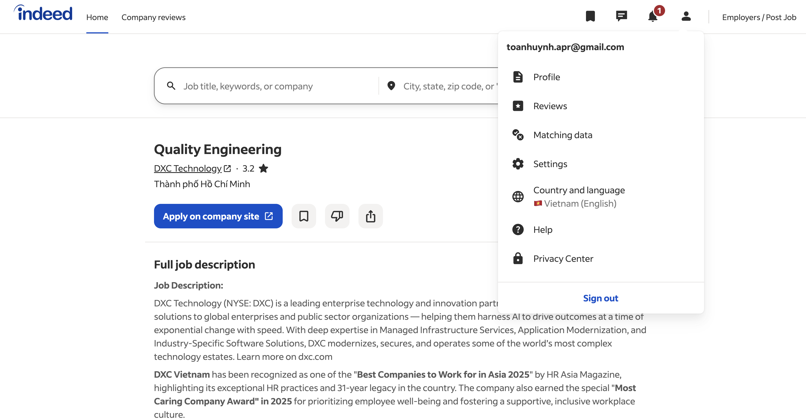

<!--
HW01 – Requirement 1 working draft

Re-verified on 24/09/2026 (evening). Sources used for dates:
- LinkedIn: relative "posted" label on the public job page (exact date not exposed).
- TopCV: `datePosted` in the page's JobPosting structured data (JSON-LD); the
  visible page shows only the application deadline ("Hạn ứng tuyển").
- ITviec: visible "Posted X days ago" label and `datePosted` metadata.
- Indeed: automated access is redirected to sign-in (bot detection); JP03's date
  was taken from the same job on DXC's official careers site / Workday.
An application deadline is not a publication date.
-->

# HW01 – QA/QC Jobs, Defects and Physical Product

## Requirement 1 – QA/QC Job Market 2026+ (40 points)

### 1.1 Search scope and evidence status

- **Submission date:** `[dd/mm/yyyy – fill in before submission]`
- **Research snapshot:** 24/09/2026. For the planned 28/09/2026 submission, the 60-day window is 30/07/2026–28/09/2026; recalculate if the actual submission date changes.
- **Number of postings:** 10 required. 8 are currently usable (JP03 confirmed still open on 24/09/2026); JP08 and JP09 return HTTP 404 (removed) on 24/09/2026 and must be replaced.
- **Postings requiring AI/LLM/AI-assisted automation:** 3 (JP01, JP02, JP04), confirmed from the posting text on 24/09/2026. JP01 is no longer accepting applications and its “1 month ago” label cannot prove the 60-day window, so a fourth AI posting is recommended as a backup.
- **Screenshot folder:** `R1_Job_Postings/`

The assignment requires 10 postings published within 60 days before submission.
Each screenshot must be taken in the student's own logged-in account, with the
posting-date label and the account name/display name visible in a corner.

### 1.2 Summary of collected postings

| ID | Position | Company | Platform | Posting date (verified 24/09/2026) | AI/LLM/AI-automation requirement | Salary | Evidence |
|---|---|---|---|---|---|---|---|
| JP01 | [QA Engineer: Full-Stack AI Engineering (HCMC)](https://www.linkedin.com/jobs/view/qa-engineer-full-stack-ai-engineering-hcmc-at-trusting-social-4448937255) | Trusting Social | LinkedIn | “1 month ago” (live page and screenshot agree); exact date not exposed; screenshot shows “Not currently accepting applications” | **Yes** – Claude Code/agents, AI Operator for quality workflows | Not disclosed | `JP01.png` |
| JP02 | [AI Quality Assurance Tester (Data Testing)](https://www.linkedin.com/jobs/view/4459648611/) | SCC Vietnam | LinkedIn | “4 weeks ago” (live); screenshot of 23/09 shows “3 weeks ago” | **Yes** – AI testing, conversational interfaces, Azure AI, EU AI Act | Not disclosed | `JP02.png` |
| JP03 | [Quality Engineering](https://jobs.vn.indeed.com/viewjob?jk=9ffa161d1774e3cf) | DXC Technology | Indeed | 08/09/2026 per DXC's official careers site (same job, ID 51585699); not shown in the Indeed screenshot | No (AI appears only in the company overview) | Not disclosed; listing says competitive package | `JP03_DXC.png` |
| JP04 | [Senior QA Engineer (AI-Augmented Quality Engineering)](https://www.linkedin.com/jobs/view/senior-qa-engineer-ai-augmented-quality-engineering-4466589603) | Ins Enco | LinkedIn | “1 week ago” (live page and screenshot agree) | **Yes** – GPT/Claude test generation, Mabl/Testim, Applitools/Percy, Postbot | 30–40 million VND gross/month | `JP04.png` |
| JP05 | [Nhân Viên Kiểm Thử Phần Mềm (Tester)](https://www.topcv.vn/viec-lam/nhan-vien-kiem-thu-phan-mem-tester/2306333.html) | Công ty TNHH Phát triển Công nghệ Thái Sơn | TopCV | 18/09/2026 (`datePosted`); deadline 18/10/2026 | No | 9–11 million VND (pay period not stated) | `JP05.png` |
| JP06 | [Software Tester](https://www.topcv.vn/viec-lam/software-tester/2308656.html) | Công ty Cổ phần Voyager | TopCV | 22/09/2026 (`datePosted`); deadline 22/10/2026 | No | Negotiable | `JP06.png` |
| JP07 | [Manual Tester](https://www.topcv.vn/viec-lam/manual-tester/2307365.html) | CTCP Phần mềm SOFTMART | TopCV | 21/09/2026 (`datePosted`); deadline 21/10/2026 | No | 9–14 million VND | `JP07.png` |
| JP08 | [Senior QA Engineer (Japanese N2+)](https://itviec.com/it-jobs/senior-qa-engineer-japanese-n2-andpad-vietnam-co-ltd-0112) | ANDPAD Vietnam | ITviec | **Replace** – screenshot shows “Expired”; link returns 404 | No | Not disclosed | `JP08.png` |
| JP09 | [QA Automation Engineer](https://itviec.com/it-jobs/qa-automation-engineer-gotymex-1349) | GoTymeX | ITviec | **Replace** – screenshot shows “Expired”; link returns 404 | No | Not disclosed | `JP09.png` |
| JP10 | [Software Quality Analyst (QA, Tester)](https://itviec.com/it-jobs/software-quality-analyst-qa-tester-mitek-vietnam-0714) | MiTek Vietnam | ITviec | 21/08/2026 (`datePosted`); screenshot shows “Posted 33 days ago”, live page “Posted 34 days ago” | No | Not disclosed; listing says competitive salary | `JP10.png` |

### 1.3 Detailed posting records

Each posting contains exactly the items required by the assignment: link,
dated screenshot, job description, required skills, salary, and 1–2 sentences
of AI Impact Analysis.

#### JP01 – QA Engineer: Full-Stack AI Engineering (HCMC), Trusting Social

- **Link:** [LinkedIn job posting](https://www.linkedin.com/jobs/view/qa-engineer-full-stack-ai-engineering-hcmc-at-trusting-social-4448937255)
- **Dated screenshot:** “1 month ago” in the saved screenshot and on the live page (24/09/2026); LinkedIn does not expose the exact date, so the 60-day window cannot be proven. The screenshot also shows “Not currently accepting applications”.

  

- **Job description:** Own quality for a product or partner-integration track, from test design and automation to defect root-cause analysis and release go/no-go decisions. Build API, E2E, mobile and visual test suites and deterministic test infrastructure (service mocks, CI gates, test-data tooling); drive Claude Code and similar agents in a test-first loop; perform exploratory and risk-based testing and investigate defects with Datadog, Temporal, Kafka and SQL.
- **Required skills:** 3+ years of QA engineering with test automation across APIs, Web UI and Mobile; TypeScript/JavaScript (Node); SQL; critical use of AI (prompting, evaluating agent output, acting as an “AI Operator” for quality workflows); strong professional English; Bachelor's in CS/Engineering or equivalent. Mobile/visual/performance testing, CI/CD, contract/mock testing and observability tools are pluses.
- **Salary:** Not disclosed (listing mentions a competitive package with 13th-month salary).
- **AI Impact Analysis:** AI can assist with test generation, code-level checks and quality-workflow automation in this role. Human QA judgment remains necessary to validate risk, coverage and failures in the full-stack product.

#### JP02 – AI Quality Assurance Tester (Data Testing), SCC Vietnam

- **Link:** [LinkedIn job posting](https://www.linkedin.com/jobs/view/4459648611/)
- **Dated screenshot:** The saved screenshot (23/09/2026) shows “3 weeks ago”; the live page on 24/09/2026 shows “4 weeks ago”. Exact date is not exposed.

  

- **Job description:** Develop test scripts and test data for Scout, an AI-powered sales agent in Microsoft Teams. Validate chat-based AI answers, data consolidation from ZoomInfo, CRM and web sources, meeting-preparation outputs, conflict-resolution rules and EU AI Act transparency/logging; perform SIT/FAT with the UK team, report defects and support the Test Lead's documentation.
- **Required skills:** Bachelor's degree; 2–4 years in software or AI testing (manual and automated); Microsoft Teams, Azure AI/Cloud and CRM platforms (Sales Hub, Salesforce); testing conversational interfaces, data pipelines or AI-powered applications; AI conflict resolution, data governance and EU AI Act; SIT/FAT, testing lifecycle, Agile, root-cause analysis and stakeholder management.
- **Salary:** Not disclosed (listing says competitive remuneration).
- **AI Impact Analysis:** AI can help generate data variations, classify failures and accelerate conversational test analysis. Human testers must still judge correctness, context and harmful or misleading responses.

#### JP03 – Quality Engineering, DXC Technology

- **Link:** [Indeed job posting](https://jobs.vn.indeed.com/viewjob?jk=9ffa161d1774e3cf)
- **Dated screenshot:** The saved Indeed screenshot shows no posting date, and Indeed redirected automated checking to its sign-in page on 24/09/2026. The same job (DXC job ID 51585699, identical description) is listed on DXC's official careers site with `datePosted: 2026-09-08`; its Workday page shows “Posted 16 Days Ago” and still accepts applications (checked 24/09/2026). Recapture the Indeed page while logged in with the posting-age label visible, and add a screenshot of the DXC careers page as supporting date evidence.
  - Supporting date source: [DXC careers – Quality Engineering, Tan Binh](https://careers.dxc.com/vi/job-vi/23717901/quality-engineering-tan-binh-vn/)

  

- **Job description:** Develop and run automated tests for lending software, integrate tests into CI/CD, create test plans and summary reports, review solution documents, and help set acceptance criteria and resolve defects.
- **Required skills:** 3+ years in software testing, including 2+ years of web/mobile and API automation; Selenium WebDriver with Java or Cypress with JavaScript/TypeScript; testing methods, Agile, and English communication. Postman/PACT/SoapUI/REST Assured and QTest/Jira/Confluence are also listed.
- **Salary:** Not disclosed; the listing describes the package as competitive.
- **AI Impact Analysis:** Automation tools can reduce repetitive regression work and provide earlier feedback in CI/CD. Human QA still needs to assess lending risks, acceptance criteria, test coverage and whether fixes address the underlying defects.

#### JP04 – Senior QA Engineer (AI-Augmented Quality Engineering), Ins Enco

- **Link:** [LinkedIn job posting](https://www.linkedin.com/jobs/view/senior-qa-engineer-ai-augmented-quality-engineering-4466589603)
- **Dated screenshot:** “1 week ago” in the saved screenshot and on the live page (24/09/2026); exact date is not exposed.

  

- **Job description:** Own quality engineering across test strategy, exploratory and risk-based testing, automation, CI/CD, production quality and AI-assisted testing. The role includes generating test cases/data with GPT or Claude, analyzing failure logs with AI and using Postbot to generate API tests.
- **Required skills:** 3–6 years of QA experience; Playwright; API testing with Postman/Bruno (REST and GraphQL); SQL/database validation; Git and CI/CD; Jira with Xray/Zephyr; Agile. AI-essential: GPT/Claude for test generation and analysis, Mabl/Testim, Applitools/Percy and Postbot. Performance, security and observability tools are nice-to-have.
- **Salary:** 30,000,000–40,000,000 VND gross/month, depending on experience.
- **AI Impact Analysis:** AI is positioned as part of test design and failure triage, so it can speed up test-data generation and log analysis. The engineer still owns risk-based coverage, review of AI suggestions and release-quality decisions.

#### JP05 – Nhân Viên Kiểm Thử Phần Mềm (Tester), Công ty TNHH Phát triển Công nghệ Thái Sơn

- **Link:** [TopCV job posting](https://www.topcv.vn/viec-lam/nhan-vien-kiem-thu-phan-mem-tester/2306333.html)
- **Dated screenshot:** Posted 18/09/2026 according to the page's `datePosted` metadata (checked 24/09/2026). The visible page and screenshot show only the application deadline (18/10/2026), so add evidence that shows the posting date.

  

- **Job description:** Plan test scenarios for software features, review design/solution documents, assess software-development process and product quality before release, and suggest testing techniques.
- **Required skills:** Requirement analysis, testing process and techniques, test planning, test-case/script creation, collaboration with developers; the listing asks for under one year of experience and a relevant university degree.
- **Salary:** 9–11 million VND; the listing does not show a pay period in the captured salary field.
- **AI Impact Analysis:** AI could help draft test ideas and test scripts from requirements, but a tester must check that the cases fit the insurance specialization tagged on the listing and the actual release risks.

#### JP06 – Software Tester, Công ty Cổ phần Voyager

- **Link:** [TopCV job posting](https://www.topcv.vn/viec-lam/software-tester/2308656.html)
- **Dated screenshot:** Posted 22/09/2026 according to the page's `datePosted` metadata (checked 24/09/2026). The visible page and screenshot show only the application deadline (22/10/2026), so add evidence that shows the posting date.

  

- **Job description:** Functionally test software and web applications, document issues, manage test cases, update bug status, retest new versions and follow up on the development team's fixes.
- **Required skills:** More than 3 years of testing experience, manual and automation testing, Google Sheets or Excel, and Japanese language ability or experience on Japanese-language projects.
- **Salary:** Negotiable; the listing states it depends on qualifications and experience.
- **AI Impact Analysis:** AI can assist with test-case drafting and bug-report summaries. Human review remains necessary for Japanese-language requirements, reproducibility and deciding whether a fix resolves the defect.

#### JP07 – Manual Tester, CTCP Phần mềm SOFTMART

- **Link:** [TopCV job posting](https://www.topcv.vn/viec-lam/manual-tester/2307365.html)
- **Dated screenshot:** Posted 21/09/2026 according to the page's `datePosted` metadata (checked 24/09/2026). The visible page and screenshot show only the application deadline (21/10/2026), so add evidence that shows the posting date.

  

- **Job description:** Analyze business requirements and specifications; prepare test plans, scenarios, cases and checklists; run functional, integration, regression, UI, end-to-end and API tests; check database data with SQL; report and verify bugs.
- **Required skills:** Manual testing, API testing, SQL, bug tracking and teamwork with developers, BAs and PO/PM; 1–2 years of web/mobile testing experience (the overview lists 1 year); IT-related degree. Automation-script experience is an advantage.
- **Salary:** 9–14 million VND; the captured salary field does not state net/gross or a pay period.
- **AI Impact Analysis:** AI can speed up checklist drafting and test-data ideas. The tester must validate outputs against the specification and confirm API/database behavior with real test evidence.

#### JP08 – Senior QA Engineer (Japanese N2+), ANDPAD Vietnam — REPLACE

- **Link:** [ITviec job posting](https://itviec.com/it-jobs/senior-qa-engineer-japanese-n2-andpad-vietnam-co-ltd-0112)
- **Dated screenshot:** No posting date visible; the screenshot shows “Expired” and the link returns HTTP 404 on 24/09/2026. This posting cannot count toward the ten.

  

- **Job description:** `[Replace this posting]`
- **Required skills:** `[Replace this posting]` (screenshot tags: QA QC, Scrum, Japanese, Tester, Agile, English)
- **Salary:** `[Replace this posting]`
- **AI Impact Analysis:** `[Write after replacement]`

#### JP09 – QA Automation Engineer, GoTymeX — REPLACE

- **Link:** [ITviec job posting](https://itviec.com/it-jobs/qa-automation-engineer-gotymex-1349)
- **Dated screenshot:** No posting date visible; the screenshot shows “Expired” and the link returns HTTP 404 on 24/09/2026. This posting cannot count toward the ten.

  

- **Job description:** `[Replace this posting]`
- **Required skills:** `[Replace this posting]` (screenshot tags: Java, Postman, API, Automation Test, JavaScript, Python)
- **Salary:** `[Replace this posting]`
- **AI Impact Analysis:** `[Write after replacement]`

#### JP10 – Software Quality Analyst (QA, Tester), MiTek Vietnam

- **Link:** [ITviec job posting](https://itviec.com/it-jobs/software-quality-analyst-qa-tester-mitek-vietnam-0714)
- **Dated screenshot:** The screenshot shows “Posted 33 days ago” (23/09/2026) and the live page shows “Posted 34 days ago” (24/09/2026), consistent with `datePosted: 2026-08-21`.

  

- **Job description:** Design, maintain and execute functional, regression and automation test cases; develop automated test scripts for Web, Windows applications and APIs; track defects through the testing lifecycle; debug and refactor tests; work with teams in Vietnam and the US to clarify requirements and designs.
- **Required skills:** 4+ years of manual and automated testing; test automation for Web, Windows applications and APIs with any framework and language; Agile; testing processes and techniques; English communication; source control. SQL, Postman, CI/CD, Python and home-building domain knowledge are pluses.
- **Salary:** Not disclosed; the listing says competitive salary.
- **AI Impact Analysis:** AI can assist with repetitive quality analysis and report drafting, while human analysts remain responsible for interpreting business impact and communicating quality decisions.

### 1.4 R1 completion checklist

- [ ] Replace JP08 and JP09 (removed listings) with two current postings; record link, dated screenshot, description, skills, salary and AI Impact Analysis.
- [ ] JP03: recapture on Indeed with the posting-age label visible, and add a screenshot of the DXC careers page showing the job (posted 08/09/2026).
- [ ] JP01: decide whether to keep it (“1 month ago”, closed to applications) or replace it with another AI-requiring posting that has a clearly recent date.
- [ ] JP05–JP07: add evidence that shows the posting date (the visible TopCV page shows only the deadline).
- [ ] Fill in the actual submission date and recheck every posting against the 60-day window.
- [ ] Confirm that each screenshot shows the account name/display name.
- [ ] Keep every AI Impact Analysis to 1–2 sentences.
- [ ] Preserve the original screenshots in the GitHub repository and reference them from the final report.
