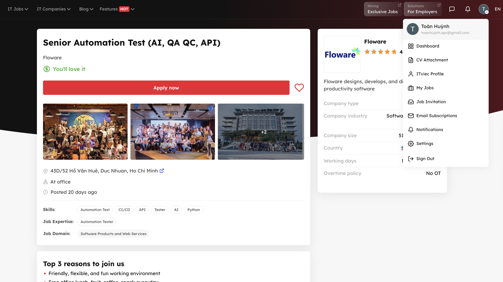
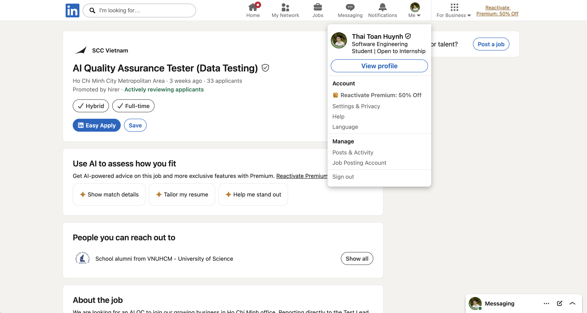
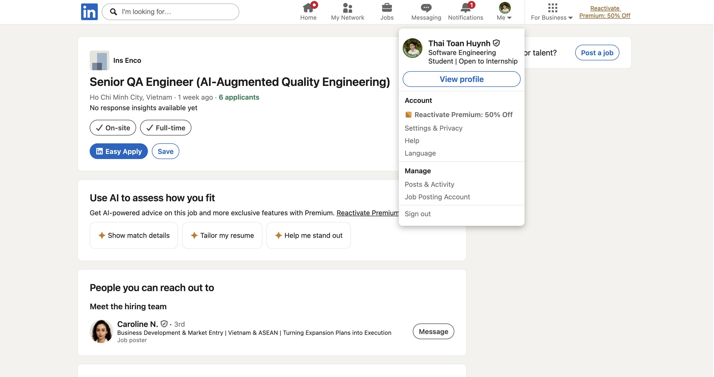
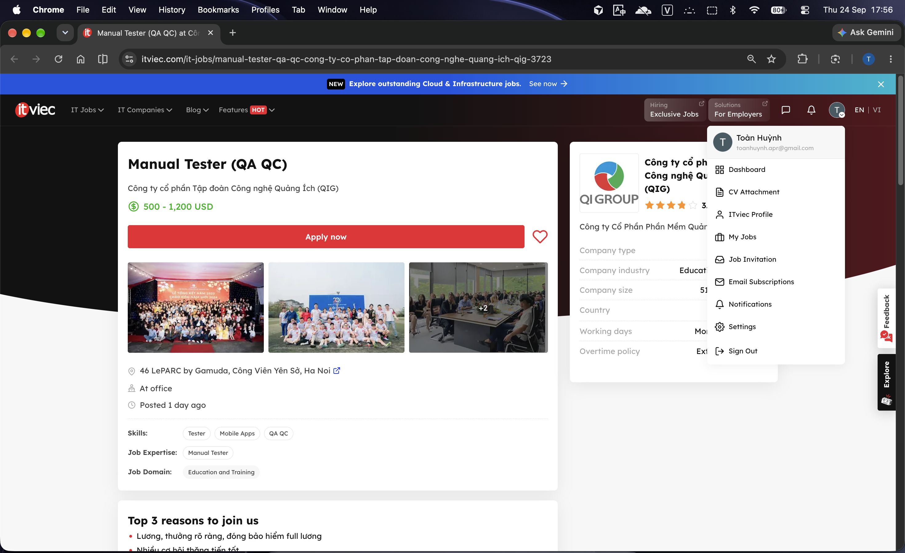
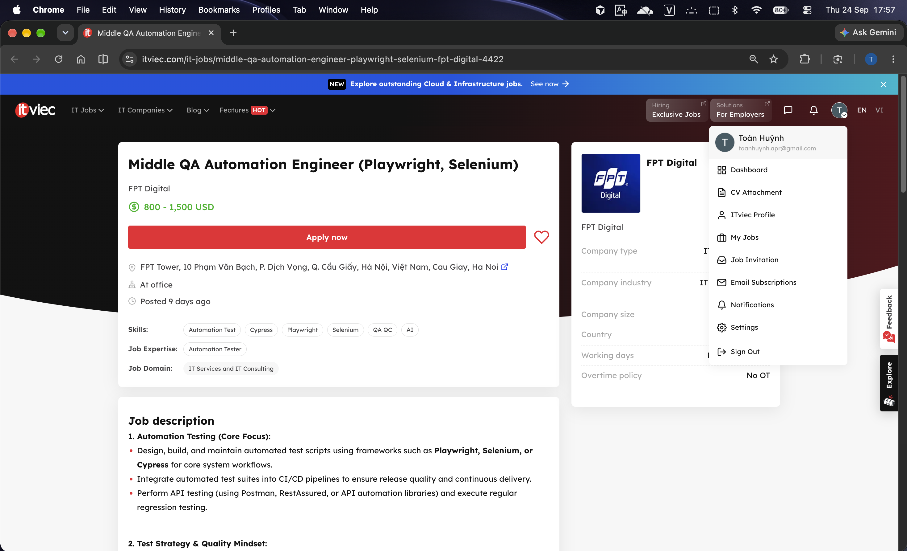
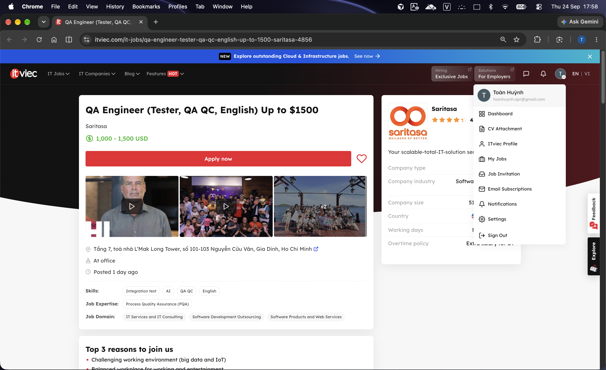
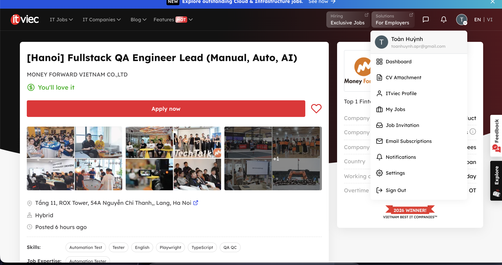
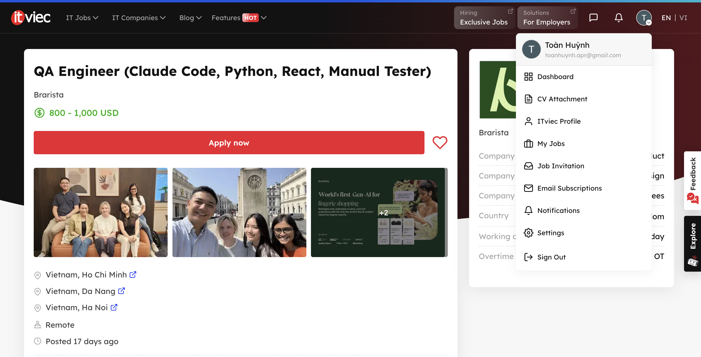
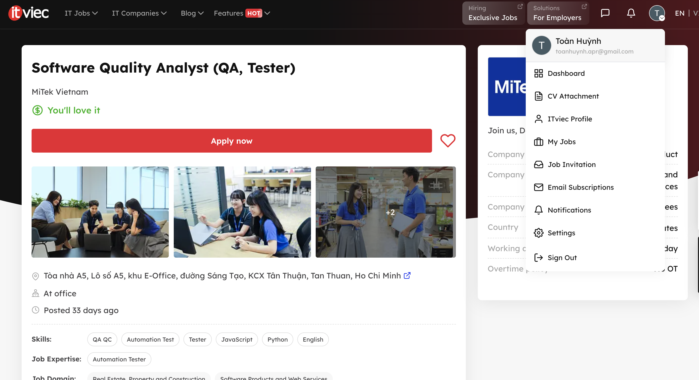

# HW01 – QA/QC Jobs, Defects and Physical Product

## Requirement 1 – QA/QC Job Market 2026+ (40 points)

### 1.1 Search scope

- **Submission date:** `[dd/mm/yyyy]`
- **60-day window:** 30/07/2026–28/09/2026
- **Number of postings:** 10
- **Postings requiring AI/LLM/AI-assisted automation skills:** 6 (JP01, JP02, JP04, JP06, JP08, JP09)
- **Screenshot folder:** `R1_Job_Postings/`

### 1.2 Summary of collected postings

| ID | Position | Company | Platform | Posting date | AI/LLM/AI-automation requirement | Salary | Evidence |
|---|---|---|---|---|---|---|---|
| JP01 | [Senior Automation Test (AI, QA QC, API)](https://itviec.com/it-jobs/senior-automation-test-ai-qa-qc-api-floware-1219) | Floware | ITviec | 04/09/2026 | **Yes** – AI tools (Claude, Cursor, Copilot, ChatGPT) for test design, automation, debugging and quality analysis | Not disclosed | `JP01.png` |
| JP02 | [AI Quality Assurance Tester (Data Testing)](https://www.linkedin.com/jobs/view/4459648611/) | SCC Vietnam | LinkedIn | 3 weeks ago (as of 23/09/2026) | **Yes** – AI testing, conversational interfaces, Azure AI, EU AI Act | Not disclosed | `JP02.png` |
| JP03 | [Quality Engineering](https://dxctechnology.wd1.myworkdayjobs.com/DXCJobs/job/VNM---HO-CHI-MINH-CITY/Quality-Engineering_51585699?src=JB-11100) | DXC Technology | DXC Careers (Workday) | 08/09/2026 | No | Not disclosed | `JP03.png` |
| JP04 | [Senior QA Engineer (AI-Augmented Quality Engineering)](https://www.linkedin.com/jobs/view/senior-qa-engineer-ai-augmented-quality-engineering-4466589603) | Ins Enco | LinkedIn | 1 week ago (as of 23/09/2026) | **Yes** – GPT/Claude test generation, Mabl/Testim, Applitools/Percy, Postbot | 30–40 million VND gross/month | `JP04.png` |
| JP05 | [Manual Tester (QA QC)](https://itviec.com/it-jobs/manual-tester-qa-qc-cong-ty-co-phan-tap-doan-cong-nghe-quang-ich-qig-3723) | Công ty cổ phần Tập đoàn Công nghệ Quảng Ích (QIG) | ITviec | 23/09/2026 | No | 500–1,200 USD/month | `JP05.png` |
| JP06 | [Middle QA Automation Engineer (Playwright, Selenium)](https://itviec.com/it-jobs/middle-qa-automation-engineer-playwright-selenium-fpt-digital-4422) | FPT Digital | ITviec | 15/09/2026 | **Yes** – testing AI/LLM features (chatbots, RAG, hallucination detection); GenAI assistants for test generation | 800–1,500 USD/month | `JP06.png` |
| JP07 | [QA Engineer (Tester, QA QC, English) Up to $1500](https://itviec.com/it-jobs/qa-engineer-tester-qa-qc-english-up-to-1500-saritasa-4856) | Saritasa | ITviec | 16/09/2026 | No (AI tools listed only as a preferred skill) | 1,000–1,500 USD/month | `JP07.png` |
| JP08 | [[Hanoi] Fullstack QA Engineer Lead (Manual, Auto, AI)](https://itviec.com/it-jobs/hanoi-fullstack-qa-engineer-lead-manual-auto-ai-money-forward-vietnam-co-ltd-4636) | Money Forward Vietnam | ITviec | 14/09/2026 | **Yes** – GenAI tools (Cursor, GitHub Copilot, LLM assistants), AI-augmented testing, testing AI features | Not disclosed | `JP08.png` |
| JP09 | [QA Engineer (Claude Code, Python, React, Manual Tester)](https://itviec.com/it-jobs/qa-engineer-claude-code-python-react-manual-tester-brarista-4435) | Brarista | ITviec | 07/09/2026 | **Yes** – Claude Code for test matrices/regression suites, verifying AI-suggested tags | 800–1,000 USD/month | `JP09.png` |
| JP10 | [Software Quality Analyst (QA, Tester)](https://itviec.com/it-jobs/software-quality-analyst-qa-tester-mitek-vietnam-0714) | MiTek Vietnam | ITviec | 21/08/2026 | No | Not disclosed | `JP10.png` |

### 1.3 Detailed posting records

#### JP01 – Senior Automation Test (AI, QA QC, API), Floware

- **Link:** [ITviec job posting](https://itviec.com/it-jobs/senior-automation-test-ai-qa-qc-api-floware-1219)
- **Dated screenshot:** “Posted 20 days ago”, captured 24/09/2026 (posted 04/09/2026).

  

- **Job description:** Ensure the quality of backend APIs in an Agile team through automated and manual testing, using AI tools to speed up test design, automation, debugging and quality analysis. Build API test scripts (Postman, Python); test an email system end to end (API, IMAP, SMTP, JMAP, migration, synchronization, authentication); run benchmarking, performance, load and stress tests; integrate API tests into Jenkins CI/CD and report results with Allure.
- **Required skills:** 4+ years of automation testing; end-to-end automation process; experience using AI tools (Claude, Cursor, Copilot, ChatGPT) to improve testing productivity; Python; API automation (Python, Java, JMeter, Postman); CI/CD (GitHub, Jenkins, GitLab CI, nightly runs); analytical and problem-solving skills. Performance and security testing are a plus.
- **Salary:** Not disclosed (net salary based on skills and experience).
- **AI Impact Analysis:** AI tools can speed up API test design, script writing and failure debugging for this role. Protocol-level behavior such as IMAP/SMTP synchronization and performance bottlenecks still needs a human tester to design realistic workloads and interpret the results.

#### JP02 – AI Quality Assurance Tester (Data Testing), SCC Vietnam

- **Link:** [LinkedIn job posting](https://www.linkedin.com/jobs/view/4459648611/)
- **Dated screenshot:** “3 weeks ago”, captured 23/09/2026.

  

- **Job description:** Develop test scripts and test data for Scout, an AI-powered sales agent in Microsoft Teams. Validate chat-based AI answers, data consolidation from ZoomInfo, CRM and web sources, meeting-preparation outputs, conflict-resolution rules and EU AI Act transparency/logging; perform SIT/FAT with the UK team, report defects and support the Test Lead's documentation.
- **Required skills:** Bachelor's degree; 2–4 years in software or AI testing (manual and automated); Microsoft Teams, Azure AI/Cloud and CRM platforms (Sales Hub, Salesforce); testing conversational interfaces, data pipelines or AI-powered applications; AI conflict resolution, data governance and EU AI Act; SIT/FAT, testing lifecycle, Agile, root-cause analysis and stakeholder management.
- **Salary:** Not disclosed (competitive remuneration).
- **AI Impact Analysis:** AI can help generate data variations, classify failures and accelerate conversational test analysis. Human testers must still judge correctness, context and harmful or misleading responses.

#### JP03 – Quality Engineering, DXC Technology

- **Link:** [DXC Careers (Workday) job posting](https://dxctechnology.wd1.myworkdayjobs.com/DXCJobs/job/VNM---HO-CHI-MINH-CITY/Quality-Engineering_51585699?src=JB-11100) – job ID 51585699
- **Dated screenshot:** “Posted 16 Days Ago”, captured 24/09/2026 (posted 08/09/2026).

  

- **Job description:** Develop and run automated tests for lending software, integrate tests into CI/CD, create test plans and summary reports, review solution documents, and help set acceptance criteria and resolve defects.
- **Required skills:** 3+ years in software testing, including 2+ years of web/mobile and API automation; Selenium WebDriver with Java or Cypress with JavaScript/TypeScript; testing methods, Agile, and English communication. Postman/PACT/SoapUI/REST Assured and QTest/Jira/Confluence are also listed.
- **Salary:** Not disclosed.
- **AI Impact Analysis:** Automation tools can reduce repetitive regression work and provide earlier feedback in CI/CD. Human QA still needs to assess lending risks, acceptance criteria, test coverage and whether fixes address the underlying defects.

#### JP04 – Senior QA Engineer (AI-Augmented Quality Engineering), Ins Enco

- **Link:** [LinkedIn job posting](https://www.linkedin.com/jobs/view/senior-qa-engineer-ai-augmented-quality-engineering-4466589603)
- **Dated screenshot:** “1 week ago”, captured 23/09/2026.

  

- **Job description:** Own quality engineering across test strategy, exploratory and risk-based testing, automation, CI/CD, production quality and AI-assisted testing. The role includes generating test cases/data with GPT or Claude, analyzing failure logs with AI and using Postbot to generate API tests.
- **Required skills:** 3–6 years of QA experience; Playwright; API testing with Postman/Bruno (REST and GraphQL); SQL/database validation; Git and CI/CD; Jira with Xray/Zephyr; Agile. AI-essential: GPT/Claude for test generation and analysis, Mabl/Testim, Applitools/Percy and Postbot. Performance, security and observability tools are nice-to-have.
- **Salary:** 30,000,000–40,000,000 VND gross/month, depending on experience.
- **AI Impact Analysis:** AI is positioned as part of test design and failure triage, so it can speed up test-data generation and log analysis. The engineer still owns risk-based coverage, review of AI suggestions and release-quality decisions.

#### JP05 – Manual Tester (QA QC), Công ty cổ phần Tập đoàn Công nghệ Quảng Ích (QIG)

- **Link:** [ITviec job posting](https://itviec.com/it-jobs/manual-tester-qa-qc-cong-ty-co-phan-tap-doan-cong-nghe-quang-ich-qig-3723)
- **Dated screenshot:** “Posted 1 day ago”, captured 24/09/2026 (posted 23/09/2026).

  

- **Job description:** Write test plans and test cases from business analysis, prepare test data and environments, execute tests, log bugs with severity and priority, track and report test results, work with developers on fixes, propose test-process improvements, and hand over product knowledge to the customer-support and operations teams.
- **Required skills:** 2+ years as a tester; solid knowledge of the test process and testing techniques; teamwork. Experience testing web or mobile applications and business-heavy software is an advantage.
- **Salary:** 500–1,200 USD/month (the job description states 13–25 million VND/month, depending on experience).
- **AI Impact Analysis:** AI can assist with drafting test cases and bug reports from business requirements. Understanding complex business rules and training the support team on them still needs a human tester.

#### JP06 – Middle QA Automation Engineer (Playwright, Selenium), FPT Digital

- **Link:** [ITviec job posting](https://itviec.com/it-jobs/middle-qa-automation-engineer-playwright-selenium-fpt-digital-4422)
- **Dated screenshot:** “Posted 9 days ago”, captured 24/09/2026 (posted 15/09/2026).

  

- **Job description:** Build and maintain Playwright/Selenium/Cypress test scripts integrated into CI/CD; perform API, regression, functional and SQL data-integrity testing; design test cases covering happy paths, edge cases and boundary conditions; manage defects in Jira. Test AI/LLM features (chatbots, data extraction, RAG workflows) for accuracy, completeness, source attribution, hallucinations and stability across prompt variations, and use ChatGPT, Claude or Copilot to generate test cases, data and scripts.
- **Required skills:** Bachelor's in CS/IT; 2–4 years of manual and automation testing; one UI automation framework (Playwright, Selenium or Cypress) with JavaScript/TypeScript, Python or Java; API testing with Postman or automation libraries; SQL; experience testing AI/LLM features or daily use of GenAI assistants in QA work. CI/CD pipelines and RAG/prompt-engineering knowledge are pluses.
- **Salary:** 800–1,500 USD/month.
- **AI Impact Analysis:** GenAI assistants can speed up test-case, data and script generation, but they cannot be trusted to judge their own output. The tester is needed to define quality criteria for LLM features and to detect hallucinated or inconsistent answers.

#### JP07 – QA Engineer (Tester, QA QC, English) Up to $1500, Saritasa

- **Link:** [ITviec job posting](https://itviec.com/it-jobs/qa-engineer-tester-qa-qc-english-up-to-1500-saritasa-4856)
- **Dated screenshot:** “Posted 1 day ago” (refreshed listing), captured 24/09/2026; original posting date 16/09/2026.

  

- **Job description:** Test web, mobile (iOS/Android) and enterprise applications built with PHP/.NET/Python backends and React/Angular frontends for international clients, working with Russia-based teams. Analyze specifications in detail, break complex requirements into simple use cases, test APIs with Postman/JMeter, and document bugs with screenshots and videos.
- **Required skills:** 3+ years as a manual QA/tester (automation preferred); software-testing theory, principles and techniques; attention to detail and analytical thinking; good English. Preferred: web, mobile and API testing, Git, and using AI tools to speed up test design and daily work.
- **Salary:** 1,000–1,500 USD/month.
- **AI Impact Analysis:** AI tools can speed up test design and bug documentation across many client projects. Turning complex design requirements into meaningful use cases and explaining quality issues to clients in English remain human work.

#### JP08 – [Hanoi] Fullstack QA Engineer Lead (Manual, Auto, AI), Money Forward Vietnam

- **Link:** [ITviec job posting](https://itviec.com/it-jobs/hanoi-fullstack-qa-engineer-lead-manual-auto-ai-money-forward-vietnam-co-ltd-4636)
- **Dated screenshot:** “Posted 6 hours ago” (refreshed listing), captured 24/09/2026; original posting date 14/09/2026.

  

- **Job description:** Act as the quality lead for Money Forward's B2B SaaS products (Michibiku, Conkan), working with Japan-based PMs and engineers. Own release-risk decisions and entry/exit criteria, architect Playwright/TypeScript (or Python) web and API automation with CI/CD quality gates, govern outsourced QA teams, drive shift-left testing, and lead adoption of GenAI tools for test design, script generation and triage, including testing AI-assisted product features.
- **Required skills:** Bachelor's in CS/SE; 8+ years of QA/SDET experience with 3+ years in a technical leadership role; fluent English; JavaScript/TypeScript or Python with Playwright, Cypress or Selenium; REST/GraphQL API testing and SQL validation; CI/CD and Dockerized test environments; daily practical use of GenAI tooling. Japanese and performance testing are nice to have.
- **Salary:** Not disclosed.
- **AI Impact Analysis:** AI tools are expected to speed up test design, script generation and triage, and the role also tests AI-assisted features. The lead still has to decide release risk, set safe AI-usage rules and judge whether AI output is correct.

#### JP09 – QA Engineer (Claude Code, Python, React, Manual Tester), Brarista

- **Link:** [ITviec job posting](https://itviec.com/it-jobs/qa-engineer-claude-code-python-react-manual-tester-brarista-4435)
- **Dated screenshot:** “Posted 17 days ago”, captured 24/09/2026 (posted 07/09/2026).

  

- **Job description:** Test Brarista's AI fit-assistance products (sizing engine, chat assistant, client dashboard and storefront widgets). Use Claude Code to generate size-conversion test matrices and regression suites, verify AI-suggested catalogue tags, own release quality and the changelog, and reproduce and triage client-reported bugs. Remote; part-time or full-time.
- **Required skills:** Strong attention to detail; proven, heavy use of Claude Code, including catching its wrong output; edge-case thinking; clear written English for bug reports and release notes. Nice to have: Intercom/Gleap, changelog writing, pytest/Playwright, e-commerce/Shopify.
- **Salary:** 800–1,000 USD/month.
- **AI Impact Analysis:** Claude Code can generate the thousands of size combinations that cannot be checked by hand. The tester must still catch wrong AI output and wrong AI-assigned tags, because these errors reach real customers without any crash or alarm.

#### JP10 – Software Quality Analyst (QA, Tester), MiTek Vietnam

- **Link:** [ITviec job posting](https://itviec.com/it-jobs/software-quality-analyst-qa-tester-mitek-vietnam-0714)
- **Dated screenshot:** “Posted 33 days ago”, captured 23/09/2026 (posted 21/08/2026).

  

- **Job description:** Design, maintain and execute functional, regression and automation test cases; develop automated test scripts for Web, Windows applications and APIs; track defects through the testing lifecycle; debug and refactor tests; work with teams in Vietnam and the US to clarify requirements and designs.
- **Required skills:** 4+ years of manual and automated testing; test automation for Web, Windows applications and APIs with any framework and language; Agile; testing processes and techniques; English communication; source control. SQL, Postman, CI/CD, Python and home-building domain knowledge are pluses.
- **Salary:** Not disclosed (competitive salary).
- **AI Impact Analysis:** AI can assist with repetitive quality analysis and report drafting, while human analysts remain responsible for interpreting business impact and communicating quality decisions.

## Requirement 2 – Software Defects 2022–2026 (20 points)

### 2.1 Scope and severity scale

- **Number of defects:** 20, all publicized between 2022 and 2025.
- **AI/LLM-related defects:** 7 (D14–D20): hallucination (D14, D15, D17), bias (D16), prompt injection (D18, D19, D20). D13 occurred in an LLM service but was caused by a conventional library bug, so it is not counted as AI/LLM-related.
- **Sources:** vendor advisories and post-incident reports, the U.S. National Vulnerability Database (NVD), regulators (FCC, CRTC, UK CAA, NHTSA, FAA) and court or tribunal decisions.
- **Severity:** for CVEs, the CVSS v3.1 base score from NVD (and the vendor score when it differs). For incidents without a CVSS score, severity is assessed with the scale below.

| Severity | Criteria used for incidents |
|---|---|
| Critical | Nationwide or global outage of essential services (aviation, emergency calls, telecommunications), or risk to life safety |
| High | Large-scale outage or data exposure, safety risk mitigated by human supervision, or harmful output delivered to a mass audience |
| Medium | Financial or legal harm to individual users; limited scope |
| Low | Cosmetic or easily worked-around issue |

### 2.2 Summary of defects

| ID | Defect | Product / system | Publicized | AI/LLM | Severity | Primary source |
|---|---|---|---|---|---|---|
| D01 | Faulty Channel File 291 content update crashes Windows hosts | CrowdStrike Falcon sensor | 19/07/2024 | No | Critical | [CrowdStrike PIR](https://www.crowdstrike.com/en-us/blog/falcon-content-update-preliminary-post-incident-report/) |
| D02 | BGP policy reordering withdraws prefixes in 19 data centers | Cloudflare network | 21/06/2022 | No | High | [Cloudflare blog](https://blog.cloudflare.com/cloudflare-outage-on-june-21-2022/) |
| D03 | Routing filter removed during core network upgrade | Rogers Communications | 08/07/2022 | No | Critical | [CRTC report](https://crtc.gc.ca/eng/publications/reports/xona2024.htm) |
| D04 | Damaged database file takes down NOTAM system | FAA NOTAM system | 11/01/2023 | No | Critical | [FAA statement](https://www.faa.gov/newsroom/faa-notam-statement) |
| D05 | Duplicate waypoint names crash flight-plan processing | NATS FPRSA-R | 28/08/2023 | No | Critical | [CAA independent review](https://www.caa.co.uk/publication/download/23337) |
| D06 | Misconfigured network element blocks all wireless traffic | AT&T Mobility network | 22/02/2024 | No | Critical | [FCC report](https://docs.fcc.gov/public/attachments/DOC-404150A1.pdf) |
| D07 | FSD Beta violates traffic laws at intersections | Tesla Full Self-Driving Beta | 16/02/2023 | No | High | [NHTSA recall 23V-085](https://static.nhtsa.gov/odi/rcl/2023/RCLRPT-23V085-3451.PDF) |
| D08 | SQL injection in MOVEit Transfer web app (CVE-2023-34362) | Progress MOVEit Transfer | 31/05/2023 | No | Critical (9.8) | [NVD](https://nvd.nist.gov/vuln/detail/CVE-2023-34362) |
| D09 | Citrix Bleed buffer over-read leaks session tokens (CVE-2023-4966) | NetScaler ADC / Gateway | 10/10/2023 | No | Critical (vendor 9.4) / High (NVD 7.5) | [NVD](https://nvd.nist.gov/vuln/detail/CVE-2023-4966) |
| D10 | X.509 email address 4-byte buffer overflow (CVE-2022-3602) | OpenSSL 3.0.0–3.0.6 | 01/11/2022 | No | High (7.5) | [OpenSSL advisory](https://www.openssl.org/news/secadv/20221101.txt) |
| D11 | Backdoor in xz/liblzma release tarballs (CVE-2024-3094) | XZ Utils 5.6.0–5.6.1 | 29/03/2024 | No | Critical (10.0) | [NVD](https://nvd.nist.gov/vuln/detail/CVE-2024-3094) |
| D12 | GlobalProtect command injection (CVE-2024-3400) | Palo Alto PAN-OS | 12/04/2024 | No | Critical (10.0) | [Palo Alto advisory](https://security.paloaltonetworks.com/CVE-2024-3400) |
| D13 | redis-py bug shows other users' chat titles and payment data | OpenAI ChatGPT | 24/03/2023 | LLM service, non-model bug | High | [OpenAI post-mortem](https://openai.com/index/march-20-chatgpt-outage/) |
| D14 | ChatGPT fabricates legal cases cited in a court filing | ChatGPT (Mata v. Avianca) | 22/06/2023 | **Yes – hallucination** | High | [Court opinion](https://law.justia.com/cases/federal/district-courts/new-york/nysdce/1:2022cv01461/575368/54/) |
| D15 | Airline chatbot invents a bereavement refund policy | Air Canada website chatbot | 14/02/2024 | **Yes – hallucination** | Medium | [BC CRT decision 2024 BCCRT 149](https://decisions.civilresolutionbc.ca/crt/crtd/en/525448/1/document.do) |
| D16 | Image generator overcorrects for diversity, producing inaccurate historical images | Google Gemini | 23/02/2024 | **Yes – bias** | High | [Google blog](https://blog.google/products/gemini/gemini-image-generation-issue/) |
| D17 | AI Overviews present satire and forum jokes as facts | Google Search AI Overviews | 30/05/2024 | **Yes – hallucination** | High | [Google blog](https://blog.google/products/search/ai-overviews-update-may-2024/) |
| D18 | Prompt injection leads to code execution in LLMMathChain (CVE-2023-29374) | LangChain ≤ 0.0.131 | 05/04/2023 | **Yes – prompt injection** | Critical (9.8) | [NVD](https://nvd.nist.gov/vuln/detail/CVE-2023-29374) |
| D19 | EchoLeak zero-click prompt injection exfiltrates Copilot data (CVE-2025-32711) | Microsoft 365 Copilot | 11/06/2025 | **Yes – prompt injection** | Critical (vendor 9.3) / High (NVD 7.5) | [NVD](https://nvd.nist.gov/vuln/detail/CVE-2025-32711) |
| D20 | Prompt injection in `ask` visualization leads to RCE (CVE-2024-5565) | Vanna.AI | 31/05/2024 | **Yes – prompt injection** | High (8.1) | [JFrog advisory](https://research.jfrog.com/vulnerabilities/vanna-prompt-injection-rce-jfsa-2024-001034449/) |

### 2.3 Detailed defect records

#### D01 – CrowdStrike Falcon Channel File 291

- **Source:** [CrowdStrike Preliminary Post Incident Review](https://www.crowdstrike.com/en-us/blog/falcon-content-update-preliminary-post-incident-report/); [Microsoft blog, 20/07/2024](https://blogs.microsoft.com/blog/2024/07/20/helping-our-customers-through-the-crowdstrike-outage/)
- **Description:** On 19/07/2024 a Rapid Response Content update (Channel File 291) was pushed to Falcon sensors on Windows. A bug in the Content Validator let a template instance with problematic content pass validation. When the sensor loaded it, the content caused an out-of-bounds memory read in the `CSagent.sys` kernel driver, crashing Windows (blue screen) and preventing normal boot.
- **Severity:** Critical – kernel-level crash of production hosts worldwide, including airlines, hospitals and banks.
- **Consequences:** Microsoft estimated 8.5 million Windows devices were affected. Many machines needed manual recovery (booting into Safe Mode and deleting the channel file).
- **Solution:** CrowdStrike reverted the channel file about 78 minutes after release. Announced fixes: additional Content Validator checks, local developer and fault-injection testing of content, staggered (canary) deployment of Rapid Response Content, customer control over update timing, and improved error handling in the Content Interpreter.

#### D02 – Cloudflare outage of 21/06/2022

- **Source:** [Cloudflare outage on June 21, 2022](https://blog.cloudflare.com/cloudflare-outage-on-june-21-2022/)
- **Description:** A change to BGP prefix-advertisement policies re-ordered policy terms on the spine routers of the 19 data centers using the new Multi-Colo PoP (MCP) architecture. The site-local terms moved behind an explicit `REJECT-THE-REST` term, so critical site-local prefixes were withdrawn. The change had been dry-run and peer reviewed, but the staged rollout steps were too large to catch the error.
- **Severity:** High – these locations were only 4% of the network but handled 50% of total requests.
- **Consequences:** From 06:27 to 07:42 UTC, users in affected regions could not reach websites and services behind Cloudflare. Servers could not reach customer origins, and the internal load balancer stopped working.
- **Solution:** Engineers reverted the change router by router. Cloudflare committed to including MCP data centers earlier in its stagger policy with MCP-specific test and deploy procedures, redesigning the policy statement to prevent incorrect ordering, and automating commit-confirm rollback.

#### D03 – Rogers Communications nationwide outage

- **Source:** [CRTC, Assessment of Rogers Networks for Resiliency and Reliability Following the 8 July 2022 Outage](https://crtc.gc.ca/eng/publications/reports/xona2024.htm)
- **Description:** During the sixth phase of a core IP network upgrade, a configuration change removed a routing filter. Without it, the distribution routers flooded the core routers with routes beyond their capacity, and the core network stopped processing traffic.
- **Severity:** Critical – nationwide loss of wireless and wireline services, including 911 access.
- **Consequences:** More than 12 million customers lost wireless and wireline services from 04:58 EDT on 08/07/2022 until services were gradually restored by 07:00 EDT on 09/07/2022. Calls to 911 were disrupted.
- **Solution:** The CRTC report recommends implementing router overload protection in the IP core and distribution networks, lab-testing planned configuration changes on equipment that reflects production, a more effective cross-team audit of configuration changes, limiting the number of changes per maintenance window with automatic rollback, and physically and logically separating the network management layer from the data network.

#### D04 – FAA NOTAM system outage

- **Source:** [FAA NOTAM statement](https://www.faa.gov/newsroom/faa-notam-statement)
- **Description:** The Notice to Air Missions (NOTAM) system failed because of a damaged database file. The FAA's preliminary review found that contract personnel unintentionally deleted files while working to correct synchronization between the live primary database and the backup database.
- **Severity:** Critical – safety-related information system for all U.S. flights became unavailable.
- **Consequences:** The FAA ordered airlines to pause all domestic departures until 09:00 Eastern Time on 11/01/2023 to validate the integrity of flight and safety information, causing widespread delays and cancellations.
- **Solution:** The FAA repaired the system and stated that it had taken steps to make the NOTAM system more resilient. From a testing perspective, the root cause points to the need for controlled, verified procedures when maintaining the primary and backup databases.

#### D05 – NATS flight-plan processing failure (FPRSA-R)

- **Source:** [CAA, Independent Review of NATS (En Route) Plc's Flight Planning System Failure on 28 August 2023 – Final Report](https://www.caa.co.uk/publication/download/23337); [NATS Major Incident Investigation Final Report](https://www.caa.co.uk/publication/download/23340)
- **Description:** FPRSA-R received a validly formatted flight plan for a flight from Los Angeles to Paris Orly with a unique combination of attributes involving two identical waypoint names outside UK airspace. The software constructed an invalid UK route, raised a critical exception and entered maintenance mode. The backup system then processed the same flight plan and failed in the same way.
- **Severity:** Critical – UK air traffic control lost automatic flight-plan processing nationwide.
- **Consequences:** Flight plans had to be entered manually, traffic was heavily restricted, and the CAA estimated that over 700,000 passengers were affected by cancellations and delays.
- **Solution:** NATS immediately added engineering procedures and message filtering. The permanent fix is a software change by the manufacturer that stops FPRSA-R from searching back beyond the entry waypoint into UK airspace, preventing the critical exception from recurring.

#### D06 – AT&T wireless network outage

- **Source:** [FCC Public Safety and Homeland Security Bureau report](https://docs.fcc.gov/public/attachments/DOC-404150A1.pdf)
- **Description:** During a network expansion, a network element was misconfigured and the change was not peer reviewed as AT&T's procedures required. The configuration error caused AT&T's network to enter "protect mode", disconnecting all devices from the wireless network.
- **Severity:** Critical – nationwide loss of voice, data and 911 service.
- **Consequences:** More than 125 million registered devices were affected, more than 92 million voice calls were blocked and more than 25,000 calls to 911 could not be completed. Rolling back the change took close to two hours, and full restoration took at least 12 hours because device registration systems were overwhelmed.
- **Solution:** AT&T rolled back the network change. After the outage it added peer-review steps and procedures ensuring maintenance work cannot proceed without confirmation that the required peer reviews were completed. The FCC also cited inadequate lab testing and post-installation testing as contributing factors.

#### D07 – Tesla FSD Beta recall 23V-085

- **Source:** [NHTSA Part 573 Safety Recall Report 23V-085](https://static.nhtsa.gov/odi/rcl/2023/RCLRPT-23V085-3451.PDF)
- **Description:** With FSD Beta engaged, the vehicle could infringe local traffic laws in four situations: travelling or turning through certain intersections during a stale yellow light; not stopping long enough at stop signs; adjusting speed incorrectly in variable speed zones; and changing lanes out of certain turn-only lanes to continue straight.
- **Severity:** High – increased collision risk if the driver does not intervene; the risk is limited by the SAE Level 2 requirement that the driver constantly supervises.
- **Consequences:** 362,758 vehicles (2016–2023 Model S and X, 2017–2023 Model 3, 2020–2023 Model Y) were recalled. Tesla identified 18 possibly related warranty claims and no known injuries or deaths.
- **Solution:** Free over-the-air software update that improves how FSD Beta handles these maneuvers.

#### D08 – MOVEit Transfer SQL injection (CVE-2023-34362)

- **Source:** [NVD CVE-2023-34362](https://nvd.nist.gov/vuln/detail/CVE-2023-34362); [CISA/FBI advisory AA23-158A](https://www.cisa.gov/news-events/cybersecurity-advisories/aa23-158a)
- **Description:** An SQL injection vulnerability in the MOVEit Transfer web application allowed an unauthenticated attacker to access the database, infer its structure, and execute SQL statements that alter or delete data.
- **Severity:** Critical – CVSS 9.8; exploited as a zero-day and listed in CISA's Known Exploited Vulnerabilities catalog.
- **Consequences:** From 27/05/2023 the CL0P ransomware gang exploited the flaw to install the LEMURLOOT web shell on internet-facing servers and steal data from MOVEit databases of many organizations.
- **Solution:** Upgrade to a fixed release (2021.0.6, 2021.1.4, 2022.0.4, 2022.1.5, 2023.0.1 or later). Progress also advised disabling HTTP/HTTPS traffic to MOVEit until patched and hunting for indicators of compromise such as `human2.aspx`.

#### D09 – Citrix Bleed (CVE-2023-4966)

- **Source:** [NVD CVE-2023-4966](https://nvd.nist.gov/vuln/detail/CVE-2023-4966); [Citrix bulletin CTX579459](https://support.citrix.com/external/article?articleUrl=CTX579459-netscaler-adc-and-netscaler-gateway-security-bulletin-for-cve20234966-and-cve20234967)
- **Description:** A buffer over-read in NetScaler ADC and Gateway configured as a gateway (VPN, ICA proxy, CVPN, RDP proxy) or AAA virtual server disclosed memory contents, including valid session tokens.
- **Severity:** Critical according to the vendor (9.4); High according to NVD (7.5).
- **Consequences:** Attackers hijacked authenticated sessions and bypassed multi-factor authentication. The flaw was exploited in the wild, including by LockBit 3.0 ransomware affiliates.
- **Solution:** Upgrade to 14.1-8.50, 13.1-49.15, 13.0-92.19 or later (FIPS/NDcPP builds as listed in the bulletin), then kill all active and persistent sessions, because stolen tokens remain valid after patching.

#### D10 – OpenSSL X.509 buffer overflow (CVE-2022-3602)

- **Source:** [OpenSSL Security Advisory, 01/11/2022](https://www.openssl.org/news/secadv/20221101.txt)
- **Description:** During X.509 certificate name-constraint checking, a crafted email address could overflow four attacker-controlled bytes on the stack. It could be triggered by a TLS client connecting to a malicious server, or by a server requesting client authentication.
- **Severity:** High (CVSS 7.5). It was pre-announced as Critical and downgraded to High after analysis of mitigating factors such as stack protections.
- **Consequences:** Possible crash (denial of service) or, in theory, remote code execution. OpenSSL reported no known working exploit at release time.
- **Solution:** Upgrade OpenSSL 3.0.x to 3.0.7. OpenSSL 1.1.1 and 1.0.2 were not affected.

#### D11 – XZ Utils backdoor (CVE-2024-3094)

- **Source:** [NVD CVE-2024-3094](https://nvd.nist.gov/vuln/detail/CVE-2024-3094); [CISA alert](https://www.cisa.gov/news-events/alerts/2024/03/29/reported-supply-chain-compromise-affecting-xz-utils-data-compression-library-cve-2024-3094)
- **Description:** Malicious code was hidden in the upstream release tarballs of xz 5.6.0 and 5.6.1. Obfuscated build steps extracted a prebuilt object file from test files and modified liblzma, which can then interfere with software that links it, such as `sshd`.
- **Severity:** Critical – CVSS 10.0; a deliberate supply-chain backdoor.
- **Consequences:** Affected packages reached development and rolling distributions (Fedora 41/Rawhide, Debian testing/unstable, openSUSE Tumbleweed, Kali, Arch). It was detected before it reached most stable enterprise releases.
- **Solution:** Downgrade to an uncompromised version such as XZ Utils 5.4.6 (CISA), install distribution-fixed packages, and hunt for malicious activity on systems that had the affected versions.

#### D12 – PAN-OS GlobalProtect command injection (CVE-2024-3400)

- **Source:** [Palo Alto Networks advisory CVE-2024-3400](https://security.paloaltonetworks.com/CVE-2024-3400)
- **Description:** Arbitrary file creation in the GlobalProtect feature of PAN-OS 10.2, 11.0 and 11.1 led to OS command injection, allowing an unauthenticated attacker to execute code with root privileges on the firewall.
- **Severity:** Critical – CVSS 10.0; discovered in production use.
- **Consequences:** An increasing number of attacks exploited the flaw, and proof-of-concept exploits were published.
- **Solution:** Upgrade to PAN-OS 10.2.9-h1, 11.0.4-h1, 11.1.2-h3 or the listed hotfixes. As interim mitigation, apply Threat Prevention signatures (Threat IDs 95187, 95189, 95191) to the GlobalProtect interface. Compromised devices can use an enhanced factory reset.

#### D13 – ChatGPT data exposure on 20/03/2023

- **Source:** [OpenAI, March 20 ChatGPT outage: Here's what happened](https://openai.com/index/march-20-chatgpt-outage/)
- **Description:** A bug in the open-source redis-py client library caused cancelled requests to leave corrupted connections. The next request on such a connection could receive cached data belonging to a different user.
- **Severity:** High – exposure of personal and partial payment data.
- **Consequences:** Some users saw other users' chat history titles. For about 1.2% of ChatGPT Plus subscribers active during a nine-hour window, name, email, payment address, the last four digits of the card number and the card expiration date could have been visible to another user.
- **Solution:** OpenAI took ChatGPT offline, patched the bug with the Redis maintainers, added redundant checks that returned data belongs to the requesting user, and improved logging.

#### D14 – ChatGPT hallucinated case law (Mata v. Avianca)

- **Source:** [Mata v. Avianca, Inc., Opinion and Order on Sanctions, S.D.N.Y., 22/06/2023](https://law.justia.com/cases/federal/district-courts/new-york/nysdce/1:2022cv01461/575368/54/)
- **Description:** Lawyers used ChatGPT for legal research and submitted a brief citing six judicial decisions that did not exist. ChatGPT generated fake case names, quotations and internal citations, and when asked, stated that the cases were real.
- **Severity:** High – fabricated authority submitted to a federal court.
- **Consequences:** The court sanctioned the attorneys and their firm with a USD 5,000 penalty and required them to send letters to their client and to each judge falsely named as an author of the fake opinions.
- **Solution:** The court held that lawyers remain responsible for verifying every citation. The corrective practice is to check AI-generated citations against authoritative legal databases before filing.

#### D15 – Air Canada chatbot misrepresentation (Moffatt v. Air Canada)

- **Source:** [Moffatt v. Air Canada, 2024 BCCRT 149](https://decisions.civilresolutionbc.ca/crt/crtd/en/525448/1/document.do)
- **Description:** Air Canada's website chatbot told a customer that, after travelling, they could submit their ticket for a reduced bereavement rate within 90 days of the ticket issue date. The airline's bereavement policy page said the policy does not apply after travel has been completed, and an Air Canada representative later admitted the chatbot had used "misleading words".
- **Severity:** Medium – financial harm to an individual customer, but it set a legal precedent.
- **Consequences:** The tribunal found Air Canada liable for negligent misrepresentation, rejected the argument that the chatbot was responsible for its own actions, and ordered the airline to pay CAD 812.02 (damages, interest and fees).
- **Solution:** The company is accountable for all information on its website, including chatbot answers. The chatbot must be grounded in and tested against the official policy pages.

#### D16 – Gemini image generation bias

- **Source:** [Google, Gemini image generation got it wrong. We'll do better (23/02/2024)](https://blog.google/products/gemini/gemini-image-generation-issue/)
- **Description:** Tuning intended to show a range of people did not account for prompts that clearly should not show a range, such as specific historical contexts. Over time the model also became over-cautious and refused some benign prompts.
- **Severity:** High – inaccurate and biased output from a mass-market AI product.
- **Consequences:** Gemini generated historically inaccurate images of people, causing public criticism and reputational damage to Google.
- **Solution:** Google paused image generation of people in Gemini and committed to extensive testing before re-enabling it.

#### D17 – Google AI Overviews misleading answers

- **Source:** [Google, AI Overviews: About last week (30/05/2024)](https://blog.google/products/search/ai-overviews-update-may-2024/)
- **Description:** AI Overviews generated odd and wrong answers for nonsensical queries and "data voids", sometimes relying on satirical content or forum posts as if they were factual.
- **Severity:** High – misleading information shown at the top of Google Search to a mass audience.
- **Consequences:** Widely shared examples of absurd advice damaged trust in the feature and in Google Search.
- **Solution:** Google made more than a dozen technical improvements, including better detection of nonsensical queries, limiting satire and humor content, limiting user-generated content that could give misleading advice, adding triggering restrictions, and strengthening guardrails for news and health topics.

#### D18 – LangChain LLMMathChain prompt injection (CVE-2023-29374)

- **Source:** [NVD CVE-2023-29374](https://nvd.nist.gov/vuln/detail/CVE-2023-29374)
- **Description:** In LangChain through 0.0.131, LLMMathChain passed LLM-generated text to Python `exec`. A prompt injection in the user's question could make the LLM output arbitrary Python code, which was then executed.
- **Severity:** Critical – CVSS 9.8.
- **Consequences:** Any application exposing LLMMathChain to untrusted input allowed remote code execution on its server.
- **Solution:** Upgrade to LangChain 0.0.142 or later, where LLMMathChain no longer uses `exec` and evaluates expressions with `numexpr` (later constrained to `numexpr` ≥ 2.8.6, which sanitizes input).

#### D19 – EchoLeak in Microsoft 365 Copilot (CVE-2025-32711)

- **Source:** [NVD CVE-2025-32711](https://nvd.nist.gov/vuln/detail/CVE-2025-32711); [EchoLeak case study (arXiv 2509.10540)](https://arxiv.org/abs/2509.10540)
- **Description:** AI command injection in M365 Copilot allowed an unauthorized attacker to disclose information over a network. A crafted email containing hidden instructions was retrieved as context by Copilot, bypassed the cross-prompt-injection classifier and link redaction, and caused Copilot to embed sensitive data in an auto-fetched image URL, with no user interaction.
- **Severity:** Critical according to Microsoft (9.3); High according to NVD (7.5).
- **Consequences:** Potential zero-click exfiltration of any data in Copilot's context. Microsoft reported no evidence of exploitation in the wild and no affected customers.
- **Solution:** Microsoft deployed a server-side fix in May 2025, before public disclosure; no customer action was required.

#### D20 – Vanna.AI prompt injection to RCE (CVE-2024-5565)

- **Source:** [JFrog advisory JFSA-2024-001034449](https://research.jfrog.com/vulnerabilities/vanna-prompt-injection-rce-jfsa-2024-001034449/); [NVD CVE-2024-5565](https://nvd.nist.gov/vuln/detail/CVE-2024-5565)
- **Description:** Vanna's `ask` method, with `visualize=True` (the default), asks the LLM to produce Plotly code and then executes it. A prompt injection in the question can make the LLM return arbitrary Python code instead of chart code.
- **Severity:** High – CVSS 8.1.
- **Consequences:** Remote code execution on any server that passes external user input to `ask`.
- **Solution:** When `ask` receives external input, set `visualize=False`. More generally, never execute LLM-generated code outside a sandbox.

### 2.4 AI explanation errors (bias or hallucination)

**Method:** ChatGPT (GPT-5.6 Luna) was asked to explain all 20 defects in two batch prompts (R2-B01, R2-B02), followed by two rounds of more specific follow-up questions (R2-B03, R2-B04) for defects whose answers contained no error. Every claim was compared with the sources in section 2.3 (URLs were also checked for HTTP status and DNS resolution).

**Result:** confirmed errors were found for 10 of the 20 defects. For the other 10 defects, all checked claims matched the sources, so no error is claimed.

| ID | Prompt log entry (HH:MM dd/mm/yyyy) | AI claim (quoted) | Verified fact and source | Error type |
|---|---|---|---|---|
| D01 | R2-B03, 23:29 24/09/2026 | Cites “CrowdStrike RCA” with the URL of `falcon-content-update-preliminary-post-incident-report`. | That URL is the Preliminary Post Incident Review (24/07/2024); the RCA was published separately on 06/08/2024 ([CrowdStrike](https://www.crowdstrike.com/en-us/blog/channel-file-291-rca-available/)). | Hallucination (misattributed source) |
| D02 | R2-B01/B02, R2-B03, R2-B04 | – | All checked claims matched the sources in section 2.3 | No error found |
| D03 | R2-B01/B02, R2-B03, R2-B04 | – | All checked claims matched the sources in section 2.3 | No error found |
| D04 | R2-B01, 23:19 24/09/2026 | “The FAA issued a nationwide ground stop around 07:30 EST and lifted it around 09:00.” | The FAA's 7:15 a.m. EST statement already reported the pause of domestic departures, and its 8:50 a.m. EST statement said the ground stop had been lifted ([FAA](https://www.faa.gov/newsroom/faa-notam-statement)). | Hallucination (timeline) |
| D05 | R2-B01, 23:19 24/09/2026 | FPRSA-R is the “Flight Planning and Resiliency System for Airspace”. | FPRSA-R is the “Flight Plan Reception Suite Automated” sub-system ([NATS final report](https://www.caa.co.uk/publication/download/23340)). | Hallucination (invented acronym expansion) |
| D06 | R2-B01, 23:19 24/09/2026 | “AT&T restored service by around noon.” | The outage began at 2:45 AM CST; AT&T announced restoration at 2:10 PM CST, and full restoration took over 12 hours ([FCC](https://docs.fcc.gov/public/attachments/DOC-404150A1.pdf)). | Hallucination (timeline) |
| D07 | R2-B01/B02, R2-B03, R2-B04 | – | All checked claims matched the sources in section 2.3 | No error found |
| D08 | R2-B01/B02, R2-B03, R2-B04 | – | All checked claims matched the sources in section 2.3 | No error found |
| D09 | R2-B01, 23:19 24/09/2026 | The flaw “is commonly rated CVSS 3.1: 9.4 (Critical)”; the official fix was to upgrade to patched builds. | 9.4 is only the vendor score; NVD rates it 7.5 High ([NVD](https://nvd.nist.gov/vuln/detail/CVE-2023-4966)). NetScaler also required killing all active and persistent sessions after upgrading ([NetScaler](https://www.netscaler.com/blog/news/cve-2023-4966-critical-security-update-now-available-for-netscaler-adc-and-netscaler-gateway/)). | Bias (one-sided score) and incomplete fix |
| D10 | R2-B01/B02, R2-B03, R2-B04 | – | All checked claims matched the sources in section 2.3 | No error found |
| D11 | R2-B01/B02, R2-B03, R2-B04 | – | All checked claims matched the sources in section 2.3 | No error found |
| D12 | R2-B03, 23:29 24/09/2026 | Source: `https://www-dev.volexity.com/blog/2024/04/12/...`. | The host `www-dev.volexity.com` does not resolve in DNS (checked 24/09/2026); the article exists on `www.volexity.com`. | Hallucination (fabricated source) |
| D13 | R2-B01/B02, R2-B03, R2-B04 | – | All checked claims matched the sources in section 2.3 | No error found |
| D14 | R2-B01/B02, R2-B03, R2-B04 | – | All checked claims matched the sources in section 2.3 | No error found |
| D15 | R2-B02, 23:19 24/09/2026 | The chatbot “told a passenger that he could obtain a bereavement-fare refund”; “awarding C$812.02 in damages and fees”. | The decision refers to Jake Moffatt only as “they”; C$812.02 = C$650.88 damages + C$36.14 interest + C$125 fees ([2024 BCCRT 149](https://decisions.civilresolutionbc.ca/crt/crtd/en/525448/1/document.do), paras. 42–44). | Bias (gender assumption) and inaccurate breakdown |
| D16 | R2-B02, 23:19 24/09/2026 | Source: `blog.google/products/gemini/gemini-image-generation-people-update/`. | The URL returns HTTP 404; Google's explanation is at [gemini-image-generation-issue](https://blog.google/products/gemini/gemini-image-generation-issue/) (23/02/2024). | Hallucination (fabricated source) |
| D17 | R2-B02, 23:19 24/09/2026 | “On 31 May 2024, Google said it had made more than a dozen technical improvements”, citing `.../generative-ai-google-search-may-2024/`. | Google's post “AI Overviews: About last week” is dated 30 May 2024 ([Google](https://blog.google/products/search/ai-overviews-update-may-2024/)); the cited URL is the I/O launch announcement. | Hallucination (date and source) |
| D18 | R2-B03, 23:29 24/09/2026 | The vulnerability “was fixed in 0.0.132”. | The fix is in LangChain 0.0.142 ([Snyk](https://security.snyk.io/vuln/SNYK-PYTHON-LANGCHAIN-5411357)); NVD lists affected versions up to 0.0.131 only. | Hallucination (wrong version) |
| D19 | R2-B01/B02, R2-B03, R2-B04 | – | All checked claims matched the sources in section 2.3 | No error found |
| D20 | R2-B01/B02, R2-B03, R2-B04 | – | All checked claims matched the sources in section 2.3 | No error found |

## Requirement 3 – Physical Product Testing (25 points)

### 3.1 Device under test

| Field | Value |
|---|---|
| Device | Standing electric fan |
| Brand | Senko |
| Model | B813 |
| Year of manufacture | 2014 |
| Serial number (middle 4 characters masked) | `[XX****XX]` |
| Speed control | Rotary knob with marked positions `0` (Off), `1`, `2`, `3` |
| Oscillation control | Push-pull knob on the motor housing |
| Other adjustments | None |
| Test environment | `[room, floor surface, outlet voltage if known, date]` |

### 3.2 Test approach

- **State transition testing:** the fan has four speed states (Off, 1, 2, 3) and two oscillation states (on, off). Because the speed control is a rotary knob, moving between non-adjacent positions (1 → 3, 3 → 1, 3 → 0) passes through the intermediate positions; test cases cover both rotation directions.
- **Decision table:** speed × oscillation combinations (TC-09), and power state × knob position (TC-12).
- **Boundary value analysis:** the knob's end positions `0` and `3` (TC-07), the lowest speed started from standstill (TC-02), and the strongest load, Speed 3 with oscillation, for stability and endurance (TC-13, TC-15).
- **Error guessing / edge cases:** knob resting between two detents, turning beyond the end positions, oscillation changed while the fan is off, mechanical resistance at the head, and guard safety (TC-06, TC-07, TC-10, TC-11, TC-14).
- **Measurable expected results:** where no manufacturer specification is available, the tester-defined thresholds are stated in the test case so the verdict is not subjective.
- **Safety limits:** no disassembly, no contact with moving blades, no electrical fault injection. Guard checks are done unplugged.

### 3.3 Evaluation of the initial AI output (R3-T02)

ChatGPT produced 15 test cases from the corrected prompt (prompt log entry R3-T02). An earlier attempt (R3-T01) used an ambiguous control description and is kept in the prompt log only. Each R3-T02 test case was reviewed against the device and against black-box testing practice.

| AI TC | Verdict | Reasoning |
|---|---|---|
| TC01 | VALID | Correct, observable check of the Off position. |
| TC02 | INCOMPLETE | "Low-speed airflow" is not measurable; it does not check that the blades start unaided from standstill at the lowest speed, the hardest start condition for an aged motor. |
| TC03 | INCOMPLETE | "Noticeably stronger than level 1" gives no measurement method. |
| TC04 | INCOMPLETE | Same problem as TC03. |
| TC05 | VALID | The sequence 1 → 2 → 3 → 2 → 1 → 0 matches how a rotary knob is operated. |
| TC06 | INVALID | The objective is a "direct transition" from 0 to 2 and 0 to 3, which a sequential rotary knob cannot perform: the knob always passes through the lower positions. The case also duplicates TC02–TC04. |
| TC07 | INCOMPLETE | Assumes "knob UP = oscillation off" without a source, and duplicates TC09. |
| TC08 | INCOMPLETE | Assumes "push DOWN = on" without a source; no sweep angle or period is checked. |
| TC09 | INCOMPLETE | Same assumption as TC08; "remains in a fixed position" gives no stop criterion (how soon the head must stop). |
| TC10 | VALID | Speed × oscillation combination is covered. |
| TC11 | INCOMPLETE | Pass criteria ("excessive force", "ambiguous operation") are subjective; label legibility is not checked. The precondition "Fan OFF" conflicts with the step of rotating through 1–3, which runs the fan. |
| TC12 | INCOMPLETE | "An extended period, e.g. 30–60 min" is unbounded; "sparking" cannot be observed from outside the closed switch; it runs at Speed 2, not at the maximum load. |
| TC13 | INCOMPLETE | "Excessive shaking" and "tipping tendency" are undefined; it is listed under reliability although it is a stability (safety) check. |
| TC14 | INCOMPLETE | Visual inspection only, while the blades are spinning; it never checks whether a finger can actually reach a blade, which can be checked safely with the fan unplugged. |
| TC15 | VALID | Observable shutdown and restart. |

**Summary:** VALID 4/15 (26.7%), INVALID 1/15 (6.6%), INCOMPLETE 10/15 (66.7%); total 100%.

Other issues in the output:

- It twice claims that "public references" and "public documentation for the B813 family" confirm the design, but only shows citation markers (`:chatgpt-content-reference`) with no document that can be checked. These claims are unverifiable and were not used.
- It assumes the oscillation direction (push = on) without asking.
- It has no case for power interruption, although a mechanical knob keeps its position when power is lost.

### 3.4 Edge cases missed by the AI

None of the following cases appear in R3-T02.

| Final TC | Edge case | Why the AI missed it |
|---|---|---|
| TC-06 | Speed knob left between two detents | The prompt listed four discrete positions, so ChatGPT modelled the knob as four valid states and only tested those. A physical knob can also rest between marks; this invalid input partition exists on the device but not in the text description, so the AI never derived it. |
| TC-07 | Speed knob turned beyond its end positions `0` and `3` | ChatGPT treated "0–3" as the complete input domain and tested values inside it, but not outside the boundaries. Whether the knob stops at `3` or wraps to `0` is not in the prompt, and the AI did not ask; boundary value analysis requires testing just beyond each end. |
| TC-10 | Oscillation knob changed while the fan is off | Every oscillation case in R3-T02 has the precondition "fan running". ChatGPT tested the two controls in one order only (speed first, then oscillation) and did not enumerate the combination speed `0` + oscillation on, which a user can easily set. |
| TC-11 | Head held or turned by hand while oscillating | ChatGPT deliberately kept safety cases "observation-based" and avoided physical interaction with the fan. It also only considered inputs through the two controls, not external forces on the head, such as a child or a curtain stopping it, which the oscillation gear must tolerate. |
| TC-12 | Power interruption with the knob left at a speed position | ChatGPT considered only the user controls as inputs, not the environment (mains power). Because a mechanical knob keeps its position, the fan restarts on its own when power returns, for example during the night or while someone is cleaning it. This risk only appears when the tester thinks about the device's state after an outage. |

Evidence: screenshots of the R3-T02 conversation — `R3_Device/ai_output_R3-T02.png`.

The explanations above were drafted with Cursor (prompt log R3-C03) and reviewed by the student.

### 3.5 Final test cases

Verdict values: PASS, FAIL, NOT RUN. Test cases that have not been executed are marked NOT RUN.

| ID | Objective | Preconditions | Input | Steps | Expected result | Actual result | Verdict | Technique | Edge (AI-missed) | Evidence |
|---|---|---|---|---|---|---|---|---|---|---|
| TC-01 | Controls are identifiable and labels legible | Fan unplugged | Visual inspection; turn the speed knob through every position | 1. Without the manual, identify the Off, 1, 2, 3 marks and the oscillation knob. 2. Read each mark and the knob pointer from 1 m. 3. Turn the speed knob through every position. | Every position mark and the pointer are readable; each position has a distinct detent (click) so the user can feel where it stops. | NOT RUN | NOT RUN | Usability | No | – |
| TC-02 | Lowest speed starts from standstill | Fan plugged in, blades fully stopped for ≥ 5 min, knob at `0` | Knob to `1` | 1. Turn the knob to `1`. 2. Start stopwatch. 3. Stop it when blades reach steady rotation. | Blades start unaided (no hand push) and reach steady rotation within 5 s. Start time recorded. | NOT RUN | NOT RUN | BVA | No | – |
| TC-03 | Speeds are distinct and increasing | Fan running, oscillation off, paper strip hung 1 m in front of the guard | Knob at `1`, `2`, `3` | 1. Run 30 s at each speed. 2. Record the strip deflection and the sound level (phone app, 1 m). 3. Repeat once. | Deflection and sound level increase strictly from 1 to 2 to 3. | NOT RUN | NOT RUN | EP | No | – |
| TC-04 | Speed transitions in both rotation directions | Fan running at `1` | 1→2→3, then 3→2→1; 1→3 and 3→1 in one continuous turn | 1. Turn step by step up, then down, pausing 10 s at each position. 2. Turn 1→3 and 3→1 in one continuous movement. 3. Observe the speed after each stop. | The speed always matches the position the knob stops at, with no stop, hum or stall during the turn. | NOT RUN | NOT RUN | State transition | No | – |
| TC-05 | Off from each speed and coast-down | Fan running | Knob to `0` from `1`, `2`, `3` | 1. At each speed turn the knob to `0`. 2. Time until the blades stop. | The motor is de-energised as soon as the knob reaches `0`; the blades coast to a stop; times recorded and longer for higher speeds. | NOT RUN | NOT RUN | State transition | No | – |
| TC-06 | Knob left between two detents | Fan at `0` | Knob stopped halfway between `0`–`1`, `1`–`2`, `2`–`3` | 1. Turn the knob slowly and stop midway between two marks. 2. Release it and observe the knob and the motor for 10 s. | The knob snaps to one of the two marked positions, or the fan runs steadily at one of the two speeds; no intermittent start/stop, hum or stall. | NOT RUN | NOT RUN | Error guessing | **Yes** | – |
| TC-07 | Knob turned beyond its end positions | Fan at `3` | Gentle extra turn past `3`; then from `0`, gentle turn backwards past `0` | 1. At `3`, keep turning gently in the same direction. 2. At `0`, turn gently in the opposite direction. 3. Observe the knob and the fan. | The knob behaves as marked on the panel: it either stops firmly at the end mark or moves to the next marked position. It never rests at an unmarked position, and the fan speed always matches the marked position. | NOT RUN | NOT RUN | BVA | **Yes** | – |
| TC-08 | Oscillation on/off, sweep angle and period | Fan at `2`, oscillation off, tape marks on the floor for the head direction | Oscillation knob | 1. Toggle oscillation on. 2. Time three full sweeps. 3. Mark both end positions and measure the angle. 4. Toggle off. | Head sweeps smoothly and symmetrically; period consistent across the three sweeps (± 1 s); stops within one sweep after toggling off. Angle and period recorded. | NOT RUN | NOT RUN | State transition | No | – |
| TC-09 | Oscillation at each speed | Oscillation on | `1`, `2`, `3` | 1. Run one full sweep at each speed. 2. Listen for clicking or grinding. | Oscillation continues at every speed with no sticking, stopping or grinding noise. | NOT RUN | NOT RUN | Decision table | No | – |
| TC-10 | Oscillation set while the fan is off | Fan at `0`, oscillation off | Oscillation knob on, then speed knob to `1` | 1. With the fan off, set oscillation on. 2. Confirm the motor does not start. 3. Turn the speed knob to `1`. | Changing the oscillation knob does not start the motor; after turning to `1`, the fan runs and oscillates immediately. | NOT RUN | NOT RUN | State transition | **Yes** | – |
| TC-11 | Head held or turned by hand | Fan at `1`, hand on the rear motor housing only (never the guard) | Gentle hold for 2 s during oscillation; gentle turn with oscillation off | 1. With oscillation on, hold the head still for 2 s, then release. 2. With oscillation off, turn the head 20° and release. | Step 1: the gear slips without grinding and oscillation resumes after release. Step 2: the head stays at the new position. | NOT RUN | NOT RUN | Error guessing | **Yes** | – |
| TC-12 | Behaviour after power interruption | Fan at `2` | Unplug 10 s, plug in; repeat with knob at `0` | 1. With the knob at `2`, unplug and replug. 2. Turn the knob to `0`, unplug and replug. | Step 1: the fan restarts at Speed 2 as soon as power returns (the knob stays at `2`). Step 2: the fan stays off. | NOT RUN | NOT RUN | Decision table | **Yes** | – |
| TC-13 | Stability at maximum load | Level floor, tape around the base | `3` + oscillation on, 5 min | 1. Run for 5 min. 2. Measure any base displacement against the tape. | No tipping or rocking; the base moves less than 1 cm. | NOT RUN | NOT RUN | BVA | No | – |
| TC-14 | Finger cannot reach the blades | Fan unplugged, blades stopped | Ruler; finger test at the front and rear guard | 1. Measure the largest gap in the front and rear guard. 2. Try to touch a blade with a fingertip through the gap. 3. Pull the guard clips gently by hand. | A fingertip cannot reach a blade; the guard stays closed when pulled by hand. | NOT RUN | NOT RUN | Error guessing | No (AI TC14 is visual only) | – |
| TC-15 | Endurance for 60 min | Clear area, room temperature recorded | `3` + oscillation on, 60 min | 1. Run 60 min. 2. At 0, 30 and 60 min record speed, oscillation, noise, and whether the motor housing and cord can be touched comfortably. | Continuous operation and oscillation; no burning smell or smoke; housing and cord warm but comfortable to touch; noise level stable. | NOT RUN | NOT RUN | Reliability | No | – |

### 3.6 Execution evidence and defects

| TC | Video (YouTube Unlisted, ≤ 60 s, narrated) |
|---|---|
| `[TC-xx]` | `[link]` |

| Defect ID | TC | Summary | Expected | Actual | Severity | GitHub Issue |
|---|---|---|---|---|---|---|
| – | – | No defects recorded yet (no test executed). | – | – | – | – |

## AI Critique

Across this homework the AI was most useful as a fast first draft and least reliable exactly where a tester has to be precise. In Requirement 2, ChatGPT (GPT-5.6 Luna) explained all 20 defects fluently, yet 10 explanations contained a confirmed error: shifted timelines (FAA, AT&T), an invented expansion of the acronym FPRSA-R, a wrong fix version for LangChain, source URLs that returned 404 or did not resolve, and a one-sided CVSS score for Citrix Bleed. The pattern is that the AI reproduces the shape of a correct answer and fills gaps with plausible details instead of admitting uncertainty. In Requirement 3, ChatGPT produced 15 neat test cases, but most expected results could not be measured ("noticeably stronger", "excessive shaking"), one case required a direct 0 → 3 jump that a rotary knob cannot make, and when my first prompt was ambiguous it silently assumed piano keys instead of asking. The coding assistant I used, Cursor, made the same assumption in its first draft until I corrected it. Both missed edge cases that only appear when you handle the real device: a knob resting between detents, turning past the end positions, setting oscillation while the fan is off, holding the head, and a power cut with the knob left on a speed. They missed them because they reason from the text description and from typical test suites, not from the physical input space, and ChatGPT deliberately avoided physical interaction for safety. The principle I learned is to treat AI output as an untrusted draft: verify every fact against a primary source, demand measurable expected results, and derive edge cases from the device itself.

*Drafted with Cursor (prompt log CA-47) and reviewed by the student.*

## Mandatory Disclosure

"The QA/QC mindmap, the draft report text for Requirements 1 and 2, the initial and refined test cases for Requirement 3, and the drafts of the AI Audit Report and AI Critique were initially generated by ChatGPT (GPT-5.6 Luna), Cursor Agent (Claude Opus 5.5) and Codex (OpenAI); I reviewed and modified sections 1.3, 2.3–2.4 and 3.3–3.5, added edge cases TC-06, TC-07, TC-10, TC-11 and TC-12 (proposed with Cursor and checked by me against the real Senko B813 fan); the Actual result and Verdict columns of section 3.5 were written entirely by me. The detailed AI Audit Report is attached as Appendix A. I confirm I did not use AI to generate any artifact listed in the prohibited category below."

Prohibited category (not AI-generated): the device photo with my student ID card, the execution videos with my own voice narration, the 10 job-posting screenshots showing my login name, and the prompt log timestamps.

## Appendix A – AI Audit Report and Prompt Log

- **A1:** AI Audit Report, below; the same content is in the filled AI-02 template, `AI_Forms/[AI-02] - FIT@HCMUS - AI Audit Report_En - HW01.docx`.
- **A2:** full prompt log with timestamps, `prompt_log.md`.
- The signed AI-03 Disclosure Form and AI-05 Checklist are in `AI_Forms/`.

### A1.1 Student information

| Field | Value |
|---|---|
| Student name (printed) | `[Full name]` |
| Student ID | `[StudentID]` |
| Class / Cohort | `[Class]` |
| Assignment ID | HW01 (HW01AI) |
| Assignment date | `[Submission date]` |
| AI tool(s) used | ChatGPT (GPT-5.6 Luna); Cursor Agent (Claude Opus 5.5); Codex (OpenAI) |
| AI used | [x] Yes  [ ] No |

### A1.2 Audit table – one entry per artifact

One batch generated by a single prompt counts as one artifact. Verbatim prompts and outputs are in the prompt log (Appendix A2) under the entry ID given; ISTQB references are to the CTFL v4.0 syllabus.

#### Artifact #1 – R1 QA/QC mindmap

1. **Prompt + tool:** Cursor Agent (Claude Opus 5.5), 18:08 24/09/2026, entry R1-M01.
2. **AI output:** `R1_Mindmap/QAQC_2026_Mindmap.png` and `.mmd`.
3. **Verdict:** `[pending]`
4. **Reasoning:** `[pending – the 3 mistakes found against ISTQB CTFL v4.0 §1.4 (test activities and work products), §1.4.5 (roles) and §3.1 (static testing)]`
5. **Student fix:** `[pending – corrected mindmap with the changes highlighted]`

#### Artifact #2 – R1 first report draft (planning session)

1. **Prompt + tool:** Codex (OpenAI), 23/09/2026, `[prompts to be exported and added to the prompt log]`.
2. **AI output:** `PLAN.md` and the first R1 draft (commits `e7e4d1d`–`bbbbb2a`).
3. **Verdict:** `[pending]`
4. **Reasoning:** `[pending]`
5. **Student fix:** `[pending]`

#### Artifact #3 – R1 job-posting records (revisions)

1. **Prompt + tool:** Cursor Agent (Claude Opus 5.5), 16:59–17:59 24/09/2026, entries CA-01 to CA-11.
2. **AI output:** report sections 1.2–1.3 (commits `7356154`–`b113c6e`).
3. **Verdict:** INCOMPLETE
4. **Reasoning:** The draft contained fields the specification does not ask for, placeholder descriptions, postings without valid posting-date evidence, and two expired postings (JP08, JP09). These were found by reviewing the work product against the assignment specification, as in the review process of ISTQB §3.2.
5. **Student fix:** Removed the extra fields; replaced JP01 and JP05–JP09 with postings inside the 60-day window; recaptured dated screenshots showing the login name.

#### Artifact #4 – R2 defect records D01–D20

1. **Prompt + tool:** Cursor Agent (Claude Opus 5.5), 18:14 24/09/2026, entry CA-14.
2. **AI output:** report sections 2.1–2.3 (commit `a3bb017`).
3. **Verdict:** VALID
4. **Reasoning:** Each record links to a primary source (vendor report, NVD, regulator or court decision). All 20 defects fall in 2022–2025, 7 are AI/LLM-related (≥ 5 required), and each has the description, severity and impact attributes of a defect report (ISTQB §5.5). `[Student: confirm after spot-checking the sources.]`
5. **Student fix:** None.

#### Artifact #5 – R2-B01, AI explanations of D01–D10

1. **Prompt + tool:** ChatGPT (GPT-5.6 Luna), 23:19 24/09/2026, entry R2-B01.
2. **AI output:** verbatim in entry R2-B01.
3. **Verdict:** INCOMPLETE
4. **Reasoning:** 4 of 10 explanations contain verified errors: the FAA ground-stop timeline (D04), an invented expansion of FPRSA-R (D05), the AT&T restoration time (D06), and a one-sided CVSS score with an incomplete fix (D09). A defect report must be correct and traceable to its source (ISTQB §5.5), so every claim was checked against the primary source.
5. **Student fix:** Corrected facts in section 2.3; errors recorded in section 2.4.

#### Artifact #6 – R2-B02, AI explanations of D11–D20

1. **Prompt + tool:** ChatGPT (GPT-5.6 Luna), 23:19 24/09/2026, entry R2-B02.
2. **AI output:** verbatim in entry R2-B02.
3. **Verdict:** INCOMPLETE
4. **Reasoning:** 3 of 10 explanations contain verified errors: a gender assumption and an amount given without its breakdown (D15), and fabricated or mismatched source URLs and dates (D16, D17). Same basis as artifact #5 (ISTQB §5.5).
5. **Student fix:** Corrected facts and sources in section 2.3; errors recorded in section 2.4.

#### Artifact #7 – R2-B03, follow-up questions

1. **Prompt + tool:** ChatGPT (GPT-5.6 Luna), 23:29 24/09/2026, entry R2-B03.
2. **AI output:** verbatim in entry R2-B03.
3. **Verdict:** INCOMPLETE
4. **Reasoning:** 3 of 13 answers contain verified errors: a misattributed CrowdStrike source (D01), a non-resolving `www-dev.volexity.com` host (D12), and a wrong LangChain fix version, 0.0.132 instead of 0.0.142 (D18).
5. **Student fix:** Correct sources and version recorded in section 2.4.

#### Artifact #8 – R2-B04, second follow-up

1. **Prompt + tool:** ChatGPT (GPT-5.6 Luna), 23:43 24/09/2026, entry R2-B04.
2. **AI output:** verbatim in entry R2-B04.
3. **Verdict:** VALID
4. **Reasoning:** Every checked claim matched the primary sources. The Scribd source cited for D14 could not be checked, so it is not counted as an error.
5. **Student fix:** None.

#### Artifact #9 – R3-T01, first 15 test cases

1. **Prompt + tool:** ChatGPT (GPT-5.6 Luna), 23:24 26/09/2026, entry R3-T01.
2. **AI output:** verbatim in entry R3-T01.
3. **Verdict:** INVALID
4. **Reasoning:** The prompt described the speed control ambiguously; ChatGPT assumed piano keys, while the fan has a rotary knob, so the state model behind the test cases does not match the device (ISTQB §4.2.4). TC-14 is also internally inconsistent: its steps leave Speed 2 selected, but its expected result assumes Off.
5. **Student fix:** Rejected. The prompt was corrected and re-sent as R3-T02.

#### Artifact #10 – R3-T02, 15 test cases (corrected prompt)

1. **Prompt + tool:** ChatGPT (GPT-5.6 Luna), 23:33 26/09/2026, entry R3-T02.
2. **AI output:** verbatim in entry R3-T02; screenshot `R3_Device/ai_output_R3-T02.png`.
3. **Verdict:** INCOMPLETE
4. **Reasoning:** Of the 15 cases, 4 are valid, 1 is invalid (TC06: a direct 0 → 3 transition is impossible on a sequential knob, ISTQB §4.2.4), and 10 have unmeasurable expected results. The suite misses the knob's end positions (§4.2.2 boundary value analysis), speed × oscillation and power × knob combinations (§4.2.3 decision tables), and error-guessing cases (§4.4.1). Details in section 3.3.
5. **Student fix:** Final suite in section 3.5. Changes: measurable thresholds, AI TC06 removed, TC-06, TC-07, TC-10, TC-11 and TC-12 added.

#### Artifact #11 – R3 refined test suite draft

1. **Prompt + tool:** Cursor Agent (Claude Opus 5.5), 23:24–23:34 26/09/2026, entries CA-37, CA-38 and CA-40.
2. **AI output:** report sections 3.1–3.5 (commits `3414a2d`, `b36f3f4`, `f2a856f`).
3. **Verdict:** INCOMPLETE
4. **Reasoning:** The first draft also assumed piano keys (two keys pressed together, half-pressed key) until the student corrected the control type (CA-38). The pass thresholds (5 s start, 1 cm displacement, ± 1 s sweep period, 60 min endurance) are tester-defined assumptions, and no case has been executed yet.
5. **Student fix:** Rewritten for the rotary knob (commit `b36f3f4`). `[Thresholds to be confirmed during execution.]`

#### Artifact #12 – R3 "why the AI missed it" explanations

1. **Prompt + tool:** Cursor Agent (Claude Opus 5.5), 23:36 26/09/2026, entry CA-41.
2. **AI output:** section 3.4, "Why the AI missed it" column (commit `14b4efe`).
3. **Verdict:** VALID
4. **Reasoning:** Each explanation is traced to observable content of R3-T02 (its preconditions, its "observation-based" safety note, and the absence of any power-interruption case), and matches the error-guessing rationale of ISTQB §4.4.1.
5. **Student fix:** `[None / edits made by the student]`

#### Artifact #13 – AI compliance drafts

1. **Prompt + tool:** Cursor Agent (Claude Opus 5.5), 23:44 26/09/2026, entry CA-47.
2. **AI output:** AI Critique, Mandatory Disclosure, this appendix, and the filled AI-02, AI-03 and AI-05 templates in `AI_Forms/`.
3. **Verdict:** INCOMPLETE
4. **Reasoning:** The drafts need the student's personal details and signatures, and artifacts #1 and #2 are still pending.
5. **Student fix:** `[Student details, review and signatures]`

### A1.3 Summary of AI accuracy

Artifacts #1 and #2 are pending and not counted yet.

| Metric | Count | Percentage |
|---|---|---|
| Total AI-generated artifacts audited | 11 | 100% |
| VALID (correct, accepted as-is) | 3 (#4, #8, #12) | 27.3% |
| INVALID (wrong; rejected) | 1 (#9) | 9.1% |
| INCOMPLETE (acceptable after edits) | 7 (#3, #5, #6, #7, #10, #11, #13) | 63.6% |

### A1.4 Conclusion – when should AI be used (or not)?

AI was useful for producing a first structure quickly: a 15-case table, defect explanations, a mindmap skeleton, and consistency checks across the report. It failed on precise facts (dates, version numbers, CVSS sources, URLs), on measurable expected results, and on edge cases that come from the physical device rather than from text. It also tended to assume instead of asking when the input was ambiguous. My recommendation: use AI for drafting, brainstorming coverage categories and reformatting, but never as a source of facts or as a test oracle. Every AI claim must be checked against a primary source, every expected result must be measurable, and edge cases and actual results must come from the tester's own analysis and execution on the real device.
