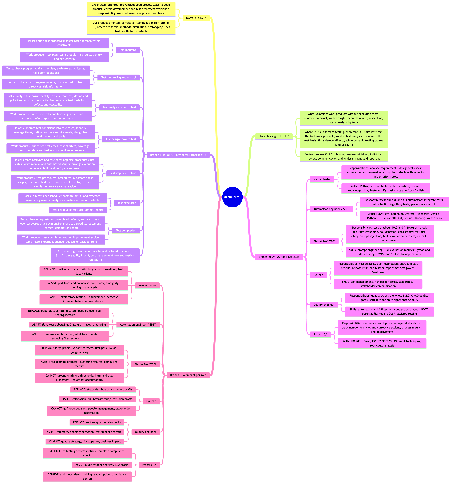

# HW01 – R1 Mindmap: QA/QC 2026+ (AI-generated, unreviewed)

> **Status:** Raw AI output for CLO G9.1 ("AI Tool draws a QA/QC role mindmap; you find 3 mistakes").
> It has **not** been checked against the ISTQB CTFL v4.0 syllabus yet. The student's review, the 3 verified mistakes and the corrected version belong in the main report / AI Audit Report, not in this file.

## Generation metadata

| Item | Value |
|---|---|
| Tool | Cursor Agent (model: Claude Opus 5.5) |
| Prompts | 18:08 24/09/2026 (initial request); 18:16 24/09/2026 (follow-up: merge into one image) |
| Rendering | Mermaid `mindmap`, `tidy-tree` layout → PNG with `@mermaid-js/mermaid-cli` 11 (Mermaid 11.17.2) |
| Source file | `QAQC_2026_Mindmap.mmd` |
| Image | `QAQC_2026_Mindmap.png` (5086 × 5460 px) |

**Prompt 1 – 18:08 24/09/2026 (verbatim):**

```text
Create a mindmap about QA/QC in 2026.
Root: "QA/QC 2026+".
Branch 1: the ISTQB CTFL v4.0 test process – list each test activity with its main tasks and work products.
Branch 2: QA/QC job roles in 2026 (manual tester, automation/SDET, AI/LLM QA tester, QA lead, quality engineer, process QA) with key responsibilities and skills.
Branch 3: for each role, mark which work AI can replace, assist, or cannot replace.
Also include the difference between QA and QC, and where static testing fits.
```

**Prompt 2 – 18:16 24/09/2026 (verbatim):**

```text
mindmap chỉ nên là 1 hình thôi
```

## Legend for Branch 3

- **REPLACE:** AI or AI-driven automation can produce the output with only spot-check review by a human.
- **ASSIST:** AI produces a draft or suggestion, but a human drives the work and verifies every result.
- **CANNOT:** The work depends on human judgement, context, physical presence or accountability.

## Mindmap



## Basis for Branch 2

The role content is based on the ten postings collected in R1 plus general industry knowledge:

| Role | Supporting R1 postings |
|---|---|
| Manual tester | JP05, JP07 |
| Automation engineer / SDET | JP01, JP03, JP06, JP10 |
| AI/LLM QA tester | JP02, JP06, JP09 |
| QA lead | JP08 |
| Quality engineer | JP03, JP04 |
| Process QA | None of the ten postings; content is from general knowledge only |

## Known uncertainties in this output

These points were produced from the model's knowledge and were not verified against the syllabus PDF (it is not in the repository):

- All CTFL section numbers (§1.2.2, §1.4.x, §3.1.3, §3.2.2) are cited from memory.
- "Evaluate exit criteria" is placed under test monitoring and control; the exact v4.0 wording for this task needs checking.
- Placing static testing under QC follows from "testing is a form of QC"; CTFL does not draw it as a separate node in the test process.
- The REPLACE / ASSIST / CANNOT classification is a judgement, not an ISTQB definition.
- Role names and skill lists are market-based; ISTQB v4.0 defines only two generic roles (test management role and testing role).
